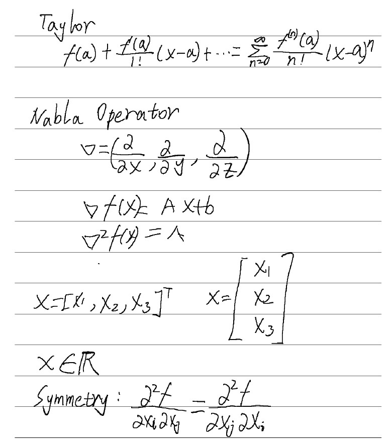
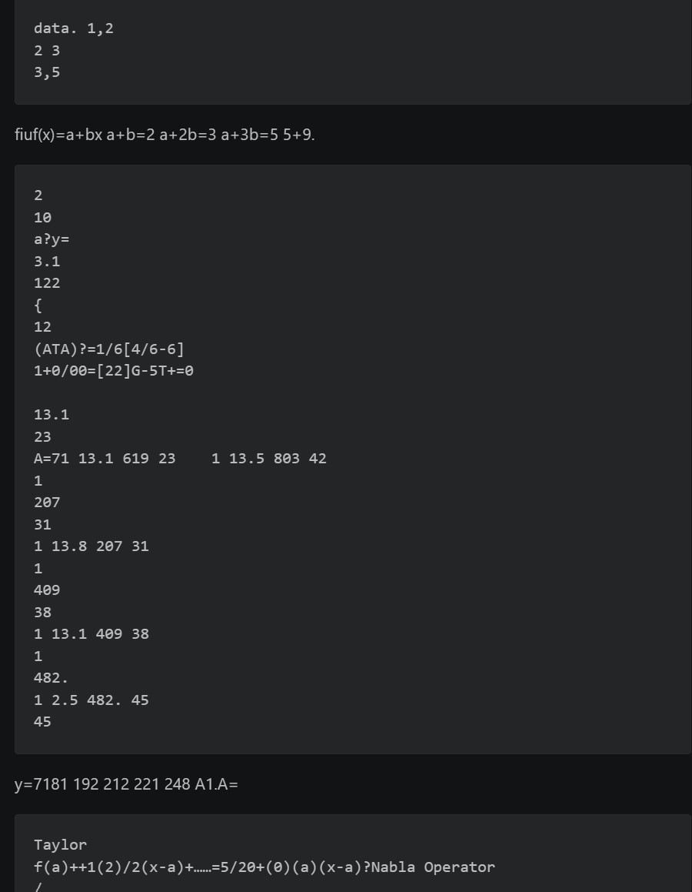
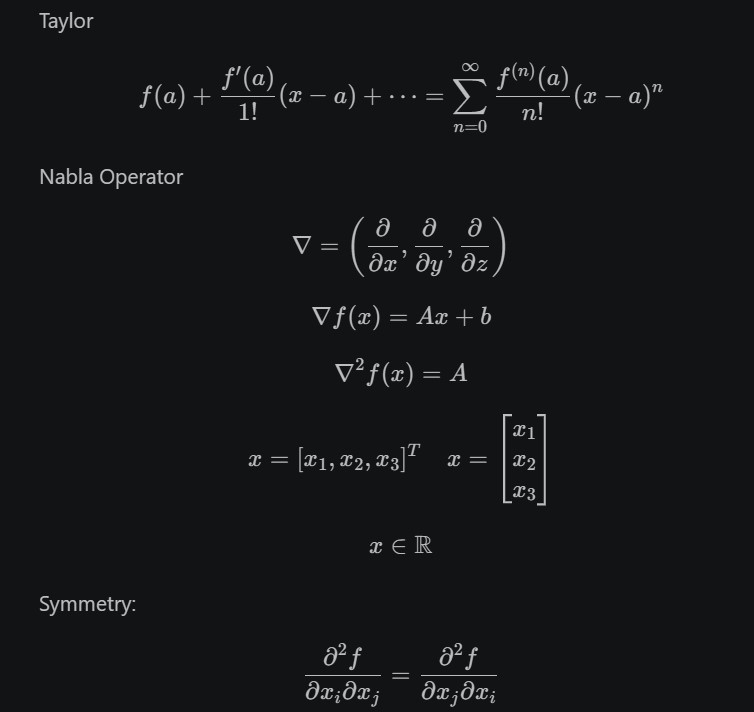

# pdf2md - 手写笔记转 Markdown

支持 **OpenAI / Claude / Gemini / 千问** 多个视觉模型的手写笔记转 Markdown 工具，自动识别公式并转为 LaTeX 格式。

**中文** | **[English](README.md)**

---

## 感想

**现代多模态大模型已经优雅地解决了手写公式识别问题。** 

用千问可以以 **¥0.00345/页** 的成本识别手写笔记，即 **一分钱识别 3 页**。这意味着：
- 💰 **成本已不再是瓶颈** — 从"高端专业工具"演变为"日常工具"
- 🎯 **准确度令人满意** — 复杂公式也能准确转换为 LaTeX
- 🚀 **选择已经充足** — OpenAI、Claude、Gemini 等多家模型可选

本项目正是这一技术突破的实践应用。希望能帮助更多学生和研究者优雅地处理手写笔记。

---

## 📖 开发背景 (Background)

最近在深入学习控制理论，虽然非常喜欢**讯飞本 (iFlytek Smart Notebook)** 带来的极致手写体验，但在将笔记整理到 **Obsidian** 时遇到了巨大障碍：原装软件对数学公式的识别极不友好，导致整理效率低下。

为了解决这个痛点，我开发了这个脚本。它支持调用**多个视觉大模型**，包括：
- 🤖 **通义千问 (Qwen-VL)**：高性价比，识别效果出色
- 🔴 **OpenAI (GPT-4o)**：业界领先，识别准确度最高
- ⚫ **Claude (Anthropic)**：多模态能力均衡
- 🔵 **Google Gemini**：轻量级，速度快（有免费额度）

选择最适合你的模型，实现：
- **混合排版精准识别**：完美处理文字与复杂公式的混合。
- **灵活成本控制**：选择性价比最优的模型。
- **笔记流无缝衔接**：手写 PDF -> Markdown -> Obsidian，一气呵成。

## 🚀 解决痛点

**讯飞本 (iFlytek X2 Notebook)** 等电子墨水屏笔记设备虽然自带识别功能，但在处理**复杂数学公式**和**混合排版**时效果往往不尽如人意。

本工具旨在解决这一问题：
1. **高精度公式识别**：调用多模态模型，能够精准识别复杂的手写数学公式并转换为标准的 LaTeX。
2. **多页支持**：一键处理整个 PDF 导出文件。
3. **成本极低**：使用 DashScope API，识别一页仅需几分钱。

## ✨ 功能特性

- ✅ **多模型支持**：OpenAI (GPT-4o) / Claude / Gemini / 千问，一个工具应对所有需求
- ✅ **PDF 转 Markdown**：自动提取 PDF 页面并识别
- ✅ **LaTeX 公式支持**：行内公式 `$ ... $` 和块级公式 `$$ ... $$`
- ✅ **高精度识别**：准确还原复杂数学公式和混合排版
- ✅ **结构化排版**：保留原始笔记的标题、列表和段落结构
- ✅ **灵活配置**：随时切换模型，对比识别效果

## 🛠️ 安装步骤

1. **克隆仓库**:
   ```bash
   git clone https://github.com/kkbin505/pdf2md.git
   cd pdf2md
   ```

2. **安装依赖**:
   ```bash
   pip install -r requirements.txt
   ```

3. **配置 API Key**:
   复制 `.env.example` 为 `.env`，然后填入对应的 API Key：
   ```bash
   cp .env.example .env
   ```
   
   编辑 `.env` 文件，填入你的密钥：
   ```env
   # 选择一个或多个模型的 API Key
   OPENAI_API_KEY=sk-proj-xxxxxxxxxxxxx
   ANTHROPIC_API_KEY=sk-ant-xxxxxxxxxxxxx
   GOOGLE_API_KEY=AIzaSyxxxxxxxxxxxxxx
   DASHSCOPE_API_KEY=sk-xxxxxxxxxxxxxxxx
   ```
   也课配置成系统环境变量
   
   获取地址：
   - OpenAI: [platform.openai.com/api-keys](https://platform.openai.com/api-keys)
   - Claude: [console.anthropic.com](https://console.anthropic.com)
   - Gemini: [aistudio.google.com/app/apikey](https://aistudio.google.com/app/apikey)
   - 千问: [DashScope 控制台](https://dashscope.console.aliyun.com/apiKey)

## 📖 使用方法

### 基础使用（默认使用千问）
```bash
python pdf2md.py your_notes.pdf
```

### 选择不同的模型提供商
```bash
# 使用 OpenAI (GPT-4o)
python pdf2md.py your_notes.pdf --provider openai

# 使用 Claude
python pdf2md.py your_notes.pdf --provider claude

# 使用 Google Gemini
python pdf2md.py your_notes.pdf --provider gemini

# 使用阿里千问（默认）
python pdf2md.py your_notes.pdf --provider qwen
```

### 高级参数
- `--provider`, `-p`: 选择模型提供商 (`openai`, `claude`, `gemini`, `qwen`，默认: `qwen`)
- `--model`, `-m`: 指定具体模型（如果不指定则使用各提供商的默认模型）
- `--output`, `-o`: 指定输出文件路径（默认与输入文件同名，扩展名为 `.md`）
- `--dpi`: 设置 PDF 渲染分辨率（默认 200，更高的 DPI 识别效果更好但更慢）
- `--api-key`, `-k`: 直接提供 API Key（或使用环境变量）

### 使用示例
```bash
# 使用 Claude，指定模型，设置高分辨率
python pdf2md.py notes.pdf --provider claude --model claude-3-5-sonnet-20241022 --dpi 300

# 使用 OpenAI，指定输出文件
python pdf2md.py notes.pdf --provider openai -o output.md

# 使用 Gemini，直接提供 API Key
python pdf2md.py notes.pdf --provider gemini --api-key AIzaSyxxxxxxxxxxxxxx
```

### 模型对比与实测结果

#### 🧪 A4 手写笔记实测数据（2页 Scratch.pdf）
| 提供商 | 模型 | Input/Output | 识别效果 | **成本/页** | 推荐度 |
|---|---|---|---|---|---|
| **Gemini** 🏆 | gemini-2.5-flash | 638/552 | 优秀 | **¥0** (免费，有额度限制) | ⭐⭐⭐⭐⭐ |
| **千问** | qwen-vl-max | 2824/589 | 优秀 | **¥0.00345** | ⭐⭐⭐⭐⭐ |
| **Claude** | claude-haiku-4-5-20251001 | 3156/629 | 优秀 | **¥0.0227** | ⭐⭐⭐⭐ |
| **OpenAI** | gpt-5.4-mini | 5550/566 | 优秀 | **¥0.0234** | ⭐⭐⭐⭐ |
| **讯飞** | 星火 | - | 差劲 | **¥0** (免费) | ⭐ |

#### 💡 选择建议
| 优先级 | 推荐模型 | 成本/页 | 理由 |
|---|---|---|---|
| **1️⃣ 首选** | Gemini | ¥0 | 完全免费，识别效果优秀，仅需管理免费额度 |
| **2️⃣ 国内优选** | 千问 | ¥0.00345 | 一页还不到一分钱，识别效果稳定 |
| **3️⃣ 追求成本** | OpenAI | ¥0.0234 | Token虽多但单价便宜，成本仅次于千问 |
| **4️⃣ 备选** | Claude | ¥0.0227 | 识别效果均衡，性能稳定，成本接近OpenAI |
| **❌ 不推荐** | 讯飞星火 | ¥0 | 虽然免费但识别效果太差，不适合公式识别 |

### 📋 识别效果对比
查看不同模型对同一手写内容的识别结果：
- [千问结果](example/Scratch_qwen.md) - 性价比最优，效果出色
- [OpenAI 结果](example/Scratch_openai.md) - 准确度最高
- [Gemini 结果](example/Scratch_gemini.md) - 速度快，新特性支持
- [Claude 结果](example/Scratch_Claude.md) - 性能均衡

对比各个模型的识别结果，选择最适合你的方案！

## 📝 识别效果实测 (Case Study)

以仓库中的 `Scratch.pdf` 为例，展示讯飞原装软件与本工具 (Qwen-VL) 的识别对比：




## 讯飞




## 千问




### 1. 泰勒展开与算子识别
**手写内容：** 包含 Taylor 展开公式、$\nabla$ 算子、矩阵等。

| 识别方案 | 识别结果 (部分展示) | 评价 |
| :--- | :--- | :--- |
| **讯飞原装** | `f(a)++1(2)/2(x-a)+……=5/20+(0)(a)(x-a)?Nabla Operator` | ❌ 公式结构完全丢失，乱码严重 |
| **本工具 (Qwen)** | `$f(a) + \frac{f'(a)}{1!}(x-a) + \cdots = \sum_{n=0}^{\infty} \frac{f^{(n)}(a)}{n!}(x-a)^n$` | ✅ 完美识别 LaTeX 结构，还原数学语义 |

### 2. 矩阵与向量识别
| 识别方案 | 识别结果 (部分展示) | 评价 |
| :--- | :--- | :--- |
| **讯飞原装** | `A=71 13.1 619 23 1 13.5 803 42` | ❌ 丢失矩阵维度，变成一连串数字 |
| **本工具 (Qwen)** | `A = \begin{bmatrix} 1 & 13.1 & 619 & 23 \\ ... \end{bmatrix}` | ✅ 完美保留矩阵行列结构 |

---

## 📄 开源协议

MIT License
